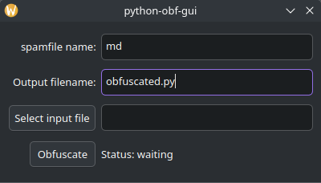

# Python obfuscator
This project obfuscate python code into multiple files using base64

Depencencies:
- pyside6

How to use?

1. Install depencencies
2. Run main.py

[Gui-less version][def]

[def]: https://github.com/enorsu/python-obfuscator/releases/tag/v1.0.1-nogui

## Screenshots

Python Obfuscator running under KDE Plasma 6.2.5 + Qt 6.8.1

